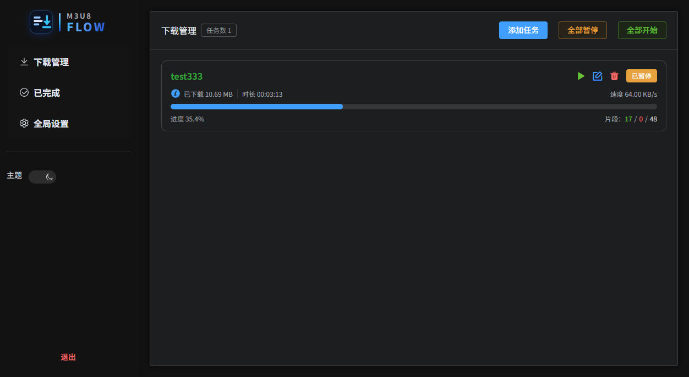
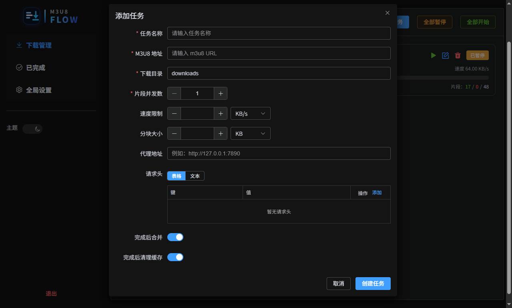

# M3U8 Flow

> 本项目主要为了解决在 NAS 上下载 M3U8 链接的视频而开发的。在调研了一轮后，发现 [lzwme/m3u8-dl](https://github.com/lzwme/m3u8-dl) 项目在下载管理上是一个很优秀的项目，但有些功能点不太满足本人的需求。因此在优先满足个人的需求前开发了这个项目。其实也不想重复造轮子了，如果未来 [lzwme/m3u8-dl](https://github.com/lzwme/m3u8-dl) 这个项目能够满足我的需求，本项目也不太迭代更新了。

基于 **FastAPI** 与 **Vue 3** 的 M3U8（HLS）下载与管理工具：解析播放列表、管理下载任务、查看已完成记录，并支持全局配置与登录鉴权。

## 界面预览

| 登录 | 下载管理 |
| --- | --- |
|  |  |

| 创建任务 | 全局设置 |
| --- | --- |
|  |  |

## docker 部署

```bash
docker run -d --name m3u8-flow -p 8000:8000 -v /path/to/downloads:/app/downloads -v /path/to/config:/app/config su825800608/m3u8-flow:latest
```

docker compose

```yaml
services:
  m3u8-flow:
    image: su825800608/m3u8-flow:latest
    container_name: m3u8-flow
    volumes:
      # 设置视频的下载路径
      - /path/to/downloads:/app/downloads
      # 设置项目的数据库存放位置
      - /path/to/config:/app/config
    environment:
      # 开启登录认证
      AUTH: true
      # 登录账号
      USERNAME: admin
      # 登录密码
      PASSWORD: 123456
    ports:
      - 8000:8000
    restart: unless-stopped
```

## 功能概览

- **下载管理**：添加 / 编辑 M3U8 任务，控制开始、暂停与删除，查看进度与速度等信息  
- **已完成**：浏览与维护已完成的任务  
- **全局设置**：应用级配置（需登录后访问）  
- **认证**：可选 JWT 登录；关闭认证后适合本地或受信环境使用  

## 技术栈

| 部分 | 技术 |
|------|------|
| 后端 | Python 3.13+、FastAPI、Tortoise ORM、SQLite、m3u8、httpx |
| 前端 | Vue 3、Vite、TypeScript、Element Plus、Pinia、Vue Router |

## 仓库结构

```
m3u8-flow/
├── backend/          # FastAPI 应用、数据库与下载逻辑
│   ├── app/          # 业务代码与 API
│   ├── config/       # 默认配置目录（SQLite 等，可配置）
│   └── downloads/    # 默认下载目录（可配置）
├── frontend/         # Vue 单页应用
└── README.md
```

## 环境要求

- **Node.js**：`^20.19.0` 或 `>=22.12.0`（见 `frontend/package.json` 的 `engines`）  
- **Python**：`>=3.13`（见 `backend/pyproject.toml`）  
- 推荐使用 **[uv](https://github.com/astral-sh/uv)** 管理 Python 依赖（项目已包含 `uv.lock`）  

## 本地开发

前后端需分别启动；开发时前端通过 Vite 将 `/api` 代理到后端（默认 `http://localhost:8000`）。

### 1. 后端

```bash
cd backend
uv sync
uv run uvicorn app.main:app --reload --host 0.0.0.0 --port 8000
```

启动时会执行数据库迁移，并在默认路径创建 SQLite 与配置目录（见下文「配置说明」）。

### 2. 前端

```bash
cd frontend
npm install
npm run dev
```

浏览器访问终端中提示的本地地址（一般为 `http://localhost:5173`）。确保后端已监听 `8000` 端口，或设置环境变量 `BACKEND_URL` 指向实际后端地址，例如：

```bash
# Windows PowerShell 示例
$env:BACKEND_URL="http://127.0.0.1:8000"; npm run dev
```

### 3. 后端测试

```bash
cd backend
uv sync --group dev
uv run pytest
```

测试会设置 `TESTING=1` 并临时关闭鉴权逻辑，具体见 `backend/tests/conftest.py`。

## 配置说明

应用使用 **Pydantic Settings** 读取环境变量。在**仓库根目录**放置 `.env`（从 `backend` 目录启动时，`app/core/config.py` 中 `env_file="../.env"` 会解析到该文件），或直接导出环境变量。

| 变量 | 说明 | 默认值 |
|------|------|--------|
| `TZ` | 时区 | `Asia/Shanghai` |
| `CONFIG_DIR` | 配置与 SQLite 所在目录 | `backend/config` |
| `DOWNLOAD_DIR` | 下载文件保存目录 | `backend/downloads` |
| `AUTH` | 是否启用登录 | `true` |
| `USERNAME` | 登录用户名 | `admin` |
| `PASSWORD` | 登录密码 | `123456` |
| `SECRET_KEY` | JWT 签名密钥 | 随机生成（生产环境请务必固定为强随机值） |
| `ACCESS_TOKEN_EXPIRE_MINUTES` | 访问令牌有效期（分钟） | `30` |
| `REFRESH_TOKEN_EXPIRE_MINUTES` | 刷新令牌有效期（分钟） | `10080`（7 天） |
| `REFRESH_TOKEN_REPLACE_MINUTES` | 刷新令牌轮换周期（分钟） | `1440`（1 天） |

生产环境请修改默认密码、设置稳定的 `SECRET_KEY`，并视情况限制网络访问。

## 生产部署（前后端一体）

后端在挂载 API 后，会将**非 `/api` 路径**映射到 `backend/static`，用于提供前端构建产物与 Vue Router 的 SPA 回退（见 `backend/app/static_serving.py`）。

1. 构建前端：

   ```bash
   cd frontend
   npm run build
   ```

2. 将 `frontend/dist/` 下的全部文件复制到 `backend/static/`（该目录通常在 `backend/.gitignore` 中忽略，需在服务器上生成）。

3. 使用 **Gunicorn + Uvicorn Worker** 等方式托管 `app.main:app`，并按需配置进程数、反向代理与 HTTPS。

仅部署 API、由 Nginx 单独托管静态资源时，可只运行后端 API，静态站点自行配置路由回退到 `index.html`。

## TODO

* 加密视频的解密处理
* 支持 Master Playlist 格式
* 移动端适配

## 许可证

[MIT](LICENSE)
